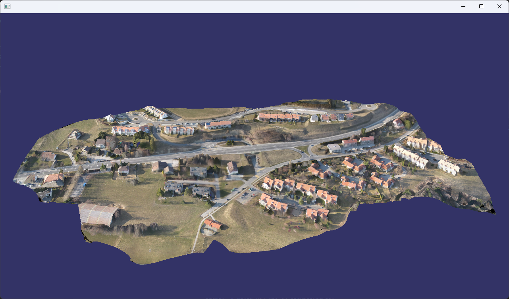
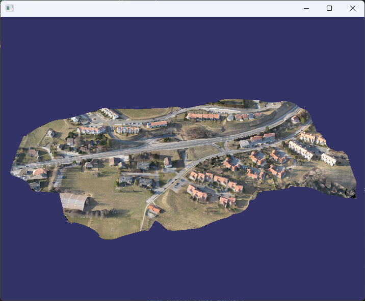
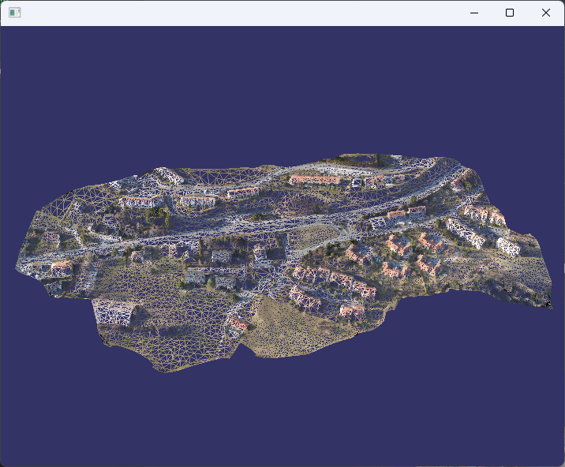

# OSG LOD 模型查看器

使用 OpenSceneGraph (OSG) 库实现的 LOD (Level of Detail) 模型加载和显示工具，支持加载 OSGB 格式的倾斜摄影数据。


## 环境要求

- Windows 10/11
- MSYS2 MinGW64 环境
- CMake 3.10+
- OpenSceneGraph 库

## 安装 OSG 库 (MSYS2)

在 MSYS2 MinGW64 终端中运行：

```bash
pacman -S mingw-w64-x86_64-OpenSceneGraph
```

## 编译步骤

### 使用 VSCode CMake Tools 插件

1. 打开 VSCode，安装 CMake Tools 插件
2. 打开本项目文件夹
3. 按 `Ctrl+Shift+P`，选择 `CMake: Select a Kit`，选择 MinGW64 工具链
4. 按 `Ctrl+Shift+P`，选择 `CMake: Configure`
5. 按 `Ctrl+Shift+P`，选择 `CMake: Build` 或按 `F7`

### 手动编译

```bash
mkdir build
cd build
cmake -G "MinGW Makefiles" ..
mingw32-make
```

## 运行

### 使用默认模型路径

直接运行程序，会加载代码中设置的默认模型路径：

```bash
./OSG_LOD_Demo.exe
```

### 指定模型路径

```bash
# Data存放数据，需要解压即可
# 测试数据百度网盘下载地址：
# 链接: https://pan.baidu.com/s/1VgguLDcLtVbBQYsFuP4_mA?pwd=1314 提取码: 1314 

# 加载 OSGB 文件
./OSG_LOD_Demo.exe D:/Github_code/OSG_Test/Data/model-osgb/Model.osgb

# 加载数据目录（自动查找 Model.osgb）
./OSG_LOD_Demo.exe Data/model-osgb
./OSG_LOD_Demo.exe Data/jinghe-model-osgb-refine
```

## 操作说明

| 操作 | 功能 |
|------|------|
| 鼠标左键拖动 | 旋转视角 |
| 鼠标中键拖动 | 平移视角 |
| 鼠标右键拖动/滚轮 | 缩放视角 |
| **F 键** | 切换显示模式（填充/线框/点）|

| 三角面模式 | 线框模式 | 顶点模式 |
|------|------|------|
|  |  |  |

## 支持的格式

- OSGB 文件 (`*.osgb`) - 倾斜摄影数据
- OSG 文件 (`*.osg`)
- 倾斜摄影数据目录（包含 `Model.osgb`）

## 修改默认模型路径

编辑 `main.cpp` 中的 `DEFAULT_MODEL_PATH` 变量：

```cpp
const std::string DEFAULT_MODEL_PATH = "D:/Github_code/OSG_Test/Data/model-osgb/Model.osgb";
```

## 项目结构

```
OSG_Test/
├── CMakeLists.txt          # CMake 配置文件
├── main.cpp                # 主程序源代码
├── README.md               # 本文件
└── Data/                   # 模型数据目录
    ├── model-osgb/         # OSGB 数据集
    │   ├── Model.osgb      # 根节点文件
    │   └── Data/           # Tile 数据
```

## 主要功能

- **LOD 模型加载**：支持加载带有多级细节的 OSGB 倾斜摄影数据
- **显示模式切换**：填充模式、线框模式、点模式（键盘按大写F按键切换）
- **自动路径查找**：支持相对路径和绝对路径，自动搜索多个可能位置
- **增强光照**：明亮的场景光照效果

## 代码说明

| 函数/类 | 功能 |
|---------|------|
| `setupBrightLighting()` | 设置明亮的场景光照 |
| `DisplayModeHandler` | 处理 F 键切换显示模式 |
| `createShapeGeode()` | 创建带材质的几何体节点 |
| `createLODNode()` | 创建演示用的 LOD 节点 |
| `createDemoScene()` | 创建演示场景 |
| `findOsgbRootFile()` | 查找 OSGB 数据集根文件 |
| `loadOsgbModel()` | 加载 OSGB 模型 |
| `findModelPath()` | 搜索模型文件路径 |
